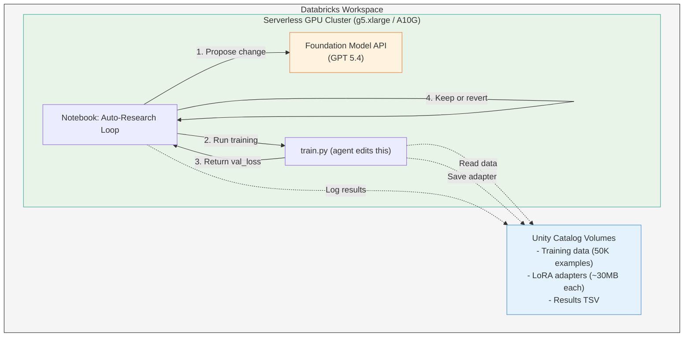

```mermaid
flowchart TB
    subgraph Databricks["Databricks Workspace"]
        subgraph GPU["Serverless GPU Cluster (g5.xlarge / A10G)"]
            NB["Notebook: Auto-Research Loop"]
            TRAIN["train.py (agent edits this)"]
            NB -->|"1. Propose change"| AGENT
            NB -->|"2. Run training"| TRAIN
            TRAIN -->|"3. Return val_loss"| NB
            NB -->|"4. Keep or revert"| NB
        end
        
        AGENT["Foundation Model API\n(GPT 5.4)"]
        UC["Unity Catalog Volumes\n- Training data (50K examples)\n- LoRA adapters (~30MB each)\n- Results TSV"]
        
        TRAIN -.->|"Read data"| UC
        TRAIN -.->|"Save adapter"| UC
        NB -.->|"Log results"| UC
    end
    
    style Databricks fill:#f5f5f5,stroke:#333
    style GPU fill:#e8f4e8,stroke:#4a9
    style AGENT fill:#fff3e0,stroke:#e8854a
    style UC fill:#e3f2fd,stroke:#4a90d9
```
