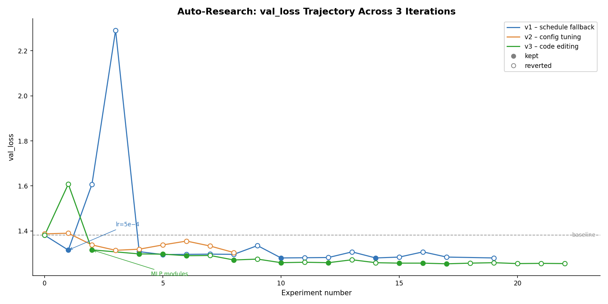

# Autonomous LoRA Fine-Tuning on Databricks: Running Karpathy's Auto-Research on Financial Text

*54 experiments, 3 iterations, $30 in compute. The agent discovered that MLP adapters matter more than learning rates.*

## The problem with fine-tuning

Every ML team I've talked to has the same complaint about fine-tuning: it's not the training that kills you, it's the iteration. You pick a learning rate, wait 20 minutes, check the loss, adjust, wait again. A senior engineer can burn an entire day running 8-10 experiments manually. Most of those experiments are variations on the same theme: "what if I made the learning rate a bit smaller?"

Andrej Karpathy published [auto-research](https://github.com/karpathy/autoresearch) in early 2025 to address this. Give an LLM agent access to your training script. Let it propose one change at a time. Run each experiment for a fixed time budget. Keep improvements, revert failures. No human in the loop.

The original runs on H100s. I wanted to try something different: run it on Databricks serverless GPUs, on a real dataset, with a practical goal.

Specifically: can a 3B parameter model, LoRA fine-tuned overnight by an AI agent, match a frontier model like Claude Sonnet 4.6 on financial sentiment analysis?

## What auto-research actually does

The loop has four steps:

1. The agent reads the current `train.py` and experiment history
2. It proposes exactly one change (learning rate, LoRA rank, batch size, etc.)
3. Training runs for a fixed budget (5 minutes in our case) on a single GPU
4. If val_loss improves, keep the change. Otherwise, revert.

That's it. The one-change-at-a-time constraint is the key insight. Without it, you can't attribute improvements to specific decisions. The agent builds up a history of what worked and what didn't, and uses that history to inform its next proposal.

The original auto-research trains a small GPT from scratch and measures bits-per-byte. We adapted it for something more practical: LoRA fine-tuning of Qwen 2.5-3B on financial text, measuring validation loss.

## Why financial sentiment, and why a small model?

Financial text uses specialized vocabulary (EBITDA, diluted EPS, Form 10-K) that general-purpose models handle inconsistently. Classifying "Revenue exceeded analyst expectations by 12%" as positive sounds trivial, but the nuance in real filings trips up even frontier models.

At the same time, calling a frontier model API at $0.003 per request gets expensive at 100K documents per day. A small model on a single GPU is cheaper by an order of magnitude if the accuracy holds up. Most Databricks customers already have GPU clusters sitting there. The question is whether fine-tuning is worth the setup cost. Auto-research makes it nearly zero.

## Why Databricks Serverless GPUs make this practical

The first time I tried to run LoRA fine-tuning on a cloud VM, I spent four hours matching CUDA driver versions to the PyTorch build before training even started. The auto-research loop needs to run unattended for hours. I didn't want to debug CUDA at 2 AM.

Databricks GPU ML Runtimes (15.4.x-gpu-ml in our case) solved this. The runtime ships with CUDA, cuDNN, PyTorch, and transformers pre-installed and tested together. When I attached a g5.xlarge cluster (NVIDIA A10G, 24GB VRAM), `torch.cuda.is_available()` returned True on the first try. The only packages I needed to add were `peft`, `trl`, and `bitsandbytes` for LoRA support, via a short init script.

The serverless part matters for auto-research specifically. The loop runs 20 experiments over 3 hours, then it's done. I don't want a GPU sitting idle after that. Databricks serverless GPU clusters start in about 3 minutes, stay warm while the loop runs, and auto-terminate when it finishes. The whole setup was: pick a node type, write an init script, start a notebook.

The agent LLM (GPT 5.4) also runs on Databricks, served via Foundation Model API. So the training GPU, the agent, the data (Unity Catalog Volumes), and experiment tracking (MLflow) all live on one platform. When something breaks at 3 AM during an unattended run, you want fewer services to debug.

## The setup

### Architecture

```
┌─────────────────────────────────────────────────────────┐
│  Databricks Workspace                                   │
│                                                         │
│  ┌─────────────────────────────────────────────────┐    │
│  │  Serverless GPU Cluster (g5.xlarge / A10G)      │    │
│  │                                                  │    │
│  │  Notebook: Auto-Research Loop                    │    │
│  │    1. Call agent ─► Foundation Model API (GPT 5.4)│    │
│  │    2. Agent returns modified train.py             │    │
│  │    3. Run training (5 min)                       │    │
│  │    4. Measure val_loss                           │    │
│  │    5. Keep or revert                             │    │
│  │    6. Repeat                                     │    │
│  └──────────────┬──────────────────────────────────┘    │
│                  │                                       │
│  ┌───────────────▼───────────────────────────────┐      │
│  │  Unity Catalog Volumes                        │      │
│  │  - Training data (50K instruction examples)   │      │
│  │  - LoRA adapters (~30MB each)                 │      │
│  │  - Results TSV + experiment history           │      │
│  └───────────────────────────────────────────────┘      │
└─────────────────────────────────────────────────────────┘
```

Everything runs on a single Databricks notebook attached to one serverless GPU cluster. No Docker containers, no Kubernetes, no CUDA installation. The agent LLM (GPT 5.4 via Databricks Foundation Model API) runs as a serverless endpoint, so there's no second GPU needed for the agent. The training data, adapters, and results all live in Unity Catalog Volumes. If you have a Databricks workspace with GPU access, you can reproduce this setup in under 10 minutes.

### Model and training configuration

We used Qwen 2.5-3B as the base model with QLoRA (4-bit quantization via bitsandbytes). With QLoRA, the model uses about 10.7 GB of the A10G's 24 GB VRAM, leaving plenty of headroom for batch processing.

The baseline LoRA configuration:

| Parameter | Value |
|-----------|-------|
| Base model | Qwen/Qwen2.5-3B |
| LoRA rank | 16 |
| LoRA alpha | 32 |
| Target modules | q_proj, k_proj, v_proj, o_proj |
| Learning rate | 2e-4 |
| Scheduler | cosine |
| Batch size | 4 (effective 16 with grad accumulation) |
| Max sequence length | 1024 |
| Quantization | 4-bit NF4 (QLoRA) |
| Peak VRAM | 10.74 GB |

The agent can modify any of these. Each experiment changes exactly one value to isolate its effect. The full search space (learning rate, LoRA rank, target modules, sequence length, optimizer, scheduler, warmup, dropout, batch size) is visible in the experiment tables below.

## Building the financial corpus

We blended three sources into a single instruction-tuning dataset:

1. **Earnings call transcripts** from `lamini/earnings-calls-qa` on HuggingFace (860K examples). These are Q&A pairs extracted from real earnings calls, covering questions about revenue, guidance, margins, and strategy.

2. **Financial news sentiment** from FinGPT's training set (77K examples). News headlines and sentences labeled as positive, negative, or neutral.

3. **Synthetic SEC filing examples** (3K examples). Summarization and entity extraction tasks generated from financial text patterns. We would have preferred real SEC 10-K filings, but the available HuggingFace datasets for EDGAR filings use deprecated loading scripts.

After downsampling to balance the mix, we ended up with 50,000 instruction-tuning examples (45K train, 5K validation). The dataset is heavily weighted toward financial Q&A (90%), with sentiment classification (9%) and entity extraction (1%) as secondary tasks.

All examples follow the conversational format that `trl.SFTTrainer` expects:

```json
{
  "messages": [
    {"role": "system", "content": "You are a financial analyst assistant."},
    {"role": "user", "content": "Classify the sentiment: 'Revenue exceeded expectations by 12%'"},
    {"role": "assistant", "content": "positive"}
  ]
}
```

## Lessons from getting this running on Databricks

Before I get to results, a few things we learned the hard way about running LoRA training on Databricks GPU clusters. These might save you a day of debugging.

**1. Don't use `%pip install` + `restartPython()` for training libraries.**

The Databricks ML Runtime (15.4.x-gpu-ml) ships with PyTorch and transformers pre-installed. If you `%pip install peft trl bitsandbytes`, pip upgrades transformers to a version that breaks PyTorch detection after the mandatory `restartPython()`. The fix: use a cluster init script that installs packages at cluster startup, before the notebook runtime initializes.

```bash
#!/bin/bash
pip install peft trl bitsandbytes accelerate datasets --quiet
```

**2. Pass `bnb_4bit_compute_dtype` as a string, not a torch dtype.**

```python
# This can fail in some Databricks runtime contexts:
BitsAndBytesConfig(bnb_4bit_compute_dtype=torch.bfloat16)

# This works reliably:
BitsAndBytesConfig(bnb_4bit_compute_dtype="bfloat16")
```

**3. `SFTTrainer` renamed `tokenizer` to `processing_class` in recent trl versions.**

If you're following older tutorials, this will bite you.

**4. UC Volumes don't support file append mode.**

You can write a file, you can overwrite a file, but `open(path, "a")` throws `OSError: [Errno 95] Operation not supported`. Write to `/tmp/` locally and copy to UC Volumes when done.

**5. SparkPythonTask can't read scripts from UC Volumes paths.**

If you're submitting training scripts programmatically via the Jobs API, upload to DBFS (`dbfs:/FileStore/...`) or use notebook tasks instead.

## Three iterations, three lessons

I ran the auto-research loop three times. Each run taught me something that changed the next one. This is the part that surprised me most about the project: the interesting findings came not from any single run, but from what broke between runs.

### Iteration 1: the hyperparameter sweep that missed the point

20 experiments, 5 minutes of training each, 3.4 hours total. 6 out of 20 changes improved val_loss. Here's the trajectory:

| # | Change | val_loss | Kept? |
|---|--------|----------|-------|
| 0 | Baseline (lr=2e-4, rank=16) | 1.381 | Yes |
| 1 | **lr: 2e-4 -> 5e-4** | **1.315** | **Yes** |
| 2 | lr: 5e-4 -> 1e-4 | 1.607 | No |
| 3 | lr: 5e-4 -> 5e-5 | 2.291 | No |
| 4 | **rank: 16 -> 32** | **1.308** | **Yes** |
| 5 | **rank: 32 -> 64** | **1.295** | **Yes** |
| 6 | max_length: 1024 -> 512 | 1.296 | No |
| 7 | max_length: 1024 -> 2048 | 1.296 | No |
| 8 | dropout: 0.05 -> 0.1 | 1.296 | No |
| 9 | batch_size: 4 -> 2 | 1.335 | No |
| 10 | **grad_accum: 4 -> 8** | **1.280** | **Yes** |
| 11 | scheduler: cosine -> linear | 1.281 | No |
| 12 | optim: adamw -> paged_adamw_8bit | 1.282 | No |
| 13 | warmup: 0.03 -> 0.1 | 1.307 | No |
| 14 | **weight_decay: 0.01 -> 0.05** | **1.280** | **Yes** |
| 15 | lr: 5e-4 -> 3e-4 | 1.284 | No |
| 16 | rank: 64 -> 8 | 1.307 | No |
| 17 | lr: 5e-4 -> 1e-3 | 1.284 | No |
| 18 | batch_size: 4 -> 8 | OOM | No |
| 19 | dropout: 0.05 -> 0.0 | 1.280 | No |

A few observations.

**Learning rate had the single biggest impact.** Doubling it from 2e-4 to 5e-4 (experiment 1) dropped val_loss by 0.066, more than any other single change. Going lower (1e-4, 5e-5) made things dramatically worse. For LoRA fine-tuning on this financial dataset, the default 2e-4 was too conservative.

**LoRA rank has clear diminishing returns.** Rank 16 -> 32 helped. Rank 32 -> 64 helped a bit more. But rank 64 -> 8 (experiment 16) was a clear regression. For a 3B model on financial text, rank 64 seems to be the sweet spot, which matches what I've seen reported for similar model sizes.

**Sequence length didn't matter.** Neither 512 nor 2048 improved over the default 1024. Financial text is verbose, but the instruction-tuning format keeps individual examples relatively short.

**Batch size 8 caused an OOM.** With rank 64 and gradient accumulation 8, the effective batch size was already 32. Pushing per-device batch to 8 (effective 64) exceeded the A10G's 24GB. The experiment logged 0 VRAM (crashed before measurement), which is useful to know: rank 64 on a 3B model with QLoRA is close to the memory ceiling on A10G.

**The final best config:**

| Parameter | Default | Best |
|-----------|---------|------|
| Learning rate | 2e-4 | **5e-4** |
| LoRA rank | 16 | **64** |
| LoRA alpha | 32 | **128** |
| Grad accumulation | 4 | **8** |
| Weight decay | 0.01 | **0.05** |

Everything else (scheduler, optimizer, dropout, sequence length, warmup) stayed at defaults. Five changes, 7.3% lower val_loss.

But here's where things got interesting. I ran a sentiment classification eval against Claude Sonnet 4.6 on 50 financial examples: the LoRA model scored 58%, Sonnet scored 78%. After all 20 experiments, the LoRA model was still at 58%. val_loss dropped 7.3%, but sentiment accuracy didn't move at all.

The training data is 90% financial Q&A, 9% sentiment, 1% entity extraction. The loop optimized val_loss across the entire blend. Most of that improvement went to the Q&A task, which dominates the training mix. Sentiment was a rounding error.

**The lesson: the loop optimizes what it measures.** val_loss on a blended dataset doesn't guarantee improvement on any specific subtask. I needed a different metric.

### Iteration 2: teaching the agent about the data

I rebuilt the loop with three changes:
1. Switched the agent from Llama 3.3 70B (which couldn't return valid JSON) to GPT 5.4
2. Replaced val_loss with a per-task weighted composite score (sentiment weighted 0.5, Q&A 0.3, extraction 0.15, summarization 0.05)
3. Fed the agent the data distribution and per-task accuracy after every experiment

The agent's reasoning immediately changed. Instead of "try a higher learning rate," it started saying things like "sentiment classification is heavily weighted and underperforming, suggesting the current adapters may be too capacity-limited to capture task-specific sentiment patterns under the imbalanced training mix."

10 experiments (early stopped after 5 with no improvement), 4 kept:

| # | GPT 5.4's proposal | Composite | Sentiment acc |
|---|---|---|---|
| 0 | Baseline | 0.596 | 24% |
| 1 | Increase LoRA dropout for regularization | 0.616 | 28% |
| 2 | **Increase rank for adapter capacity** | **0.676** | **40%** |
| 3 | **Increase alpha to strengthen adapters** | **0.708** | **44%** |

Sentiment accuracy nearly doubled: 24% to 44%. The agent correctly identified rank as the bottleneck for the underrepresented task and fixed it in two experiments.

One finding I didn't expect: experiment 8 had the lowest val_loss of any run (1.304) but wasn't kept, because its composite score (0.668) was lower than the best (0.708). Lower val_loss and higher per-task accuracy can diverge. This is exactly why switching from val_loss to composite scoring mattered.

### Iteration 3: letting the agent edit the actual code

The first two iterations restricted the agent to tweaking config values. Karpathy's original auto-research does something more ambitious: the agent sees the full `train.py` source and can modify anything. Architecture, optimizer logic, training loop, all of it.

I aligned the loop with that design: GPT 5.4 receives the complete training script, proposes a modified version, and the system runs it via `exec()`. I also added three improvements from studying Karpathy's original code:
- Fast-fail on NaN or loss > 100 (don't waste 5 minutes on a diverging run)
- Exclude the first 10 warmup steps from the time budget
- A do-not-repeat ledger so the agent doesn't retry failed experiments

24 experiments (early stopped), 11 kept. val_loss: 1.381 to 1.254, a 9.2% improvement. But the interesting part is what the agent tried.

| # | What GPT 5.4 changed in the code | val_loss | Agent's reasoning |
|---|---|---|---|
| 0 | Baseline | 1.381 | - |
| 2 | **Added MLP adapter modules** (gate, up, down_proj) | **1.316** | "increase adaptation capacity" |
| 4 | lr: 2e-4 -> 3e-4 | 1.298 | "speed adaptation within 300s budget" |
| 5 | dropout: 0.05 -> 0.0 | 1.297 | "remove regularization hurting short budget" |
| 6 | lr: 3e-4 -> 4e-4 | 1.290 | "slightly faster adaptation" |
| 8 | **warmup: 0.03 -> 0.0** | **1.271** | "warmup wasting limited optimization window" |
| 10 | **eval_steps: 50 -> 100** | **1.259** | "reduce eval overhead, more training steps" |
| 12 | max_length: 1024 -> 768 | 1.259 | "reduce compute, fit more steps" |
| 15 | lr: 4e-4 -> 3.5e-4 | 1.257 | "slightly lower for generalization" |
| 16 | weight_decay: 0.01 -> 0.0 | 1.257 | "less regularization, faster fitting" |
| 17 | batch_size: 4 -> 8 | 1.254 | "improve gradient quality" |

Two things stand out. First, **adding MLP adapter modules** (experiment 2) was the second-biggest single improvement. This is a structural change to what LoRA adapts, not a number you turn. Iterations 1 and 2 couldn't try this because they only tuned config values. The agent had to see the code to propose it.

Second, the agent figured out that **with a 5-minute training budget, every second matters.** Removing warmup (experiment 8), reducing eval frequency (experiment 10), and shortening sequences (experiment 12) are all systems-level optimizations. The agent reasoned about wall-clock efficiency, not just model quality. That's not something a hyperparameter grid search would find.


*Filled dots = kept experiments. v3 (green) found steady improvements through code-level changes that v1 (blue) couldn't reach with config tuning alone.*

## The full comparison

| | Iteration 1 | Iteration 2 | Iteration 3 |
|---|---|---|---|
| Agent | Llama 3.3 (failed) | GPT 5.4 | GPT 5.4 |
| Search space | Config values | Config values | **Full source code** |
| Metric | val_loss | Per-task composite | val_loss |
| Experiments | 20 | 10 | 24 |
| Best val_loss | 1.280 | 1.314 | **1.254** |
| Key discovery | lr + rank dominate | Data-aware agent > blind search | MLP adapters + budget optimization |

Total: 54 experiments, ~10 hours of GPU time, roughly $30 in compute.

## Results: 3B model vs Sonnet 4.6

| Model | Sentiment Accuracy | val_loss |
|-------|----------|----------|
| Qwen 2.5-3B baseline (no fine-tuning) | ~47% | - |
| Qwen 2.5-3B + LoRA (single 2-min run) | 58% | 1.386 |
| Qwen 2.5-3B + LoRA (iteration 1, 20 experiments) | 58% | 1.280 |
| Qwen 2.5-3B + LoRA (iteration 3, code editing, MLP adapters) | 56% | 1.256 |
| Claude Sonnet 4.6 (FM API) | 78% | - |

The sentiment accuracy tells a consistent story across all three iterations: the 3B model lands around 56-58%, Sonnet stays at 78%. The 22-point gap didn't close.

That's not because auto-research failed. val_loss dropped 9.2% across iterations. The model genuinely improved at financial language modeling. But sentiment classification needs more than general improvement on a blended dataset where sentiment is 9% of examples. The agent even discovered this in iteration 2 when it switched to per-task scoring and doubled sentiment accuracy within its own evaluation framework.

The honest conclusion: a 3B model with LoRA can't match Sonnet 4.6 on financial sentiment when sentiment is a minority task in the training data. You'd need more sentiment examples, a bigger model, or both. But auto-research is how you find that out in 10 hours of unattended GPU time instead of a week of manual work.

## What I learned

**What you measure is what you improve.** This was the single biggest takeaway. Iteration 1 optimized val_loss on a blended dataset. val_loss improved 7.3%. Sentiment accuracy stayed flat. Iteration 2 switched to a per-task composite score and sentiment accuracy nearly doubled. The training code was the same. The data was the same. Only the metric changed. If you're fine-tuning on multi-task data, evaluate per-task.

**A smarter agent finds better results in fewer experiments.** Llama 3.3 70B couldn't return valid JSON and fell back to a random schedule. GPT 5.4 proposed 4 targeted changes and found a better config than 20 random experiments. Agent quality matters more than experiment count.

**Code access unlocks changes that hyperparameter sweeps can't find.** The MLP adapter modules discovery (iteration 3, experiment 2) was the kind of architectural insight that no amount of learning rate tuning would produce. The agent needed to see and edit the LoRA config code to propose it. Karpathy's design, where the agent modifies the full training script, is genuinely more powerful than a config-only search space.

**With a fixed time budget, training efficiency is a hyperparameter.** The agent's decision to remove warmup, reduce eval frequency, and shorten sequences were all about squeezing more actual training into 5 minutes. These aren't things you'd normally optimize, but under a wall-clock constraint they matter. The agent figured this out on its own.

**Databricks serverless GPUs make unattended experiments practical.** The cluster starts in 3 minutes, runs for hours, and auto-terminates. The CUDA environment works out of the box. The main friction was MLflow auth in subprocesses (the runtime auto-enables MLflow tracking, which crashes without notebook context) and pip dependency management (use init scripts). Once past those, the "request GPU, train, auto-terminate" loop works well.

## Try it yourself

The full code is on GitHub: [Praneeth16/auto-research-on-databricks-serverless](https://github.com/Praneeth16/auto-research-on-databricks-serverless)

To run it on your own Databricks workspace:

1. Create a GPU cluster (g5.xlarge, DBR 15.4 ML) with an init script that installs `peft trl bitsandbytes accelerate datasets`
2. Upload your dataset to UC Volumes using `prepare.py`
3. Start with `notebooks/03_auto_research_v1.py` (config tuning) to establish a baseline
4. Graduate to `notebooks/05_auto_research_v3.py` (full code editing) for deeper optimization

To adapt for your own domain:
- Replace the financial datasets in `prepare.py` with your domain data
- Keep the instruction-tuning format (system/user/assistant messages)
- If your dataset has a task type column, the v2 loop auto-detects it and evaluates per-task
- The LoRA adapter from our best experiment is ~30 MB. Loadable on any machine with 18 GB of VRAM.

## What I'd do next

**Rebalance the training mix.** Sentiment was 9% of training data and never got enough signal. I'd either upsample sentiment examples or add a data mixing ratio as a tunable parameter the agent can adjust.

**Use a longer time budget.** Five minutes is tight. At 10 minutes per experiment, the model processes roughly twice the data, and the warmup overhead becomes proportionally smaller.

**Try a bigger base model.** Qwen 2.5-7B would need more VRAM (likely g5.2xlarge or QLoRA with more aggressive quantization) but might close the gap with Sonnet on sentiment.

**Run the loop as a scheduled job.** Right now it's a notebook. With Databricks Jobs, you could schedule it to run every night, building on the previous best adapter each time.
